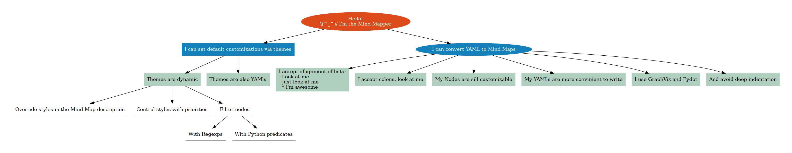

# Mind Map generator

Small program to generate mind map from YAML notes.
Built upon Graphviz and Pydot



**Features**
- Describe your map with readable, clean and minimalistic YAML
- Use themes to apply common attributes to nodes without boilerplate dot files
- Use Python expressions and regexps as predicates to apply styles dynamically

## Installation
```shell
pip install git+https://github.com/VladX09/mind-mapper
```

## Usage
```shell
Usage: mind-mapper [OPTIONS] MAP_PATH OUTPUT_PATH

  Render Mind Map from YAML description with given theme.

Options:
  -t, --theme TEXT    Built-in theme name or theme file path 
                      [default: mind_mapper.themes.default]

  -p, --program TEXT  Graphviz rendering program  [default: dot]
  -f, --format TEXT   [default: png]
  -v                  Enable debug logging
  --help              Show this message and exit.

```

## Basic map description
Check [examples](examples/)

## Use custom themes
You can apply custom theme to set node styles automatically. Check [default theme description](mind_mapper/themes/default.yml) as an example.

**Theme** is a YAML file with styles description.

Each **style** consists of:
- Predicate: defines if style should be applied to the node
- Attributes: list of GraphViz node attributes to be applied
- Order: if several styles should be applied to one node, defines an order of application (default is 0)

Example:
```yaml
level 3:
  predicate:
    type: eval
    target: NODE.depth >= 3 and len(NODE.children) >= 3
  attrs:
    shape: rectangle
    style: filled
    color: "#F2CCC3"
  order: 2
```

Multiple styles can be applyed to the same node (if an attribute is specified in several styles, the last style wins)


### Predicates
Three types of predicates are supported:

**eval**\
The sequence in "target" field will be evaluated as Python expression. "NODE" will be substituted with a node object.
```yaml
predicate:
  type: eval
  target: NODE.depth == 2
```

**regex**\
"target" will be evaluated for each node and style will be applied only if "target" matches "pattern"
```yaml
predicate:
  type: regex
  target: NODE.name
  pattern "Hello-.*"
```

**name**\
The alias for regex applied to the name
```yaml
predicate:
  type: name
  pattern "Hello-.*"
```

### Inplace attributes
You can overwrite theme attributes in map description. Just specify `attrs` field with GraphVis attributes.
